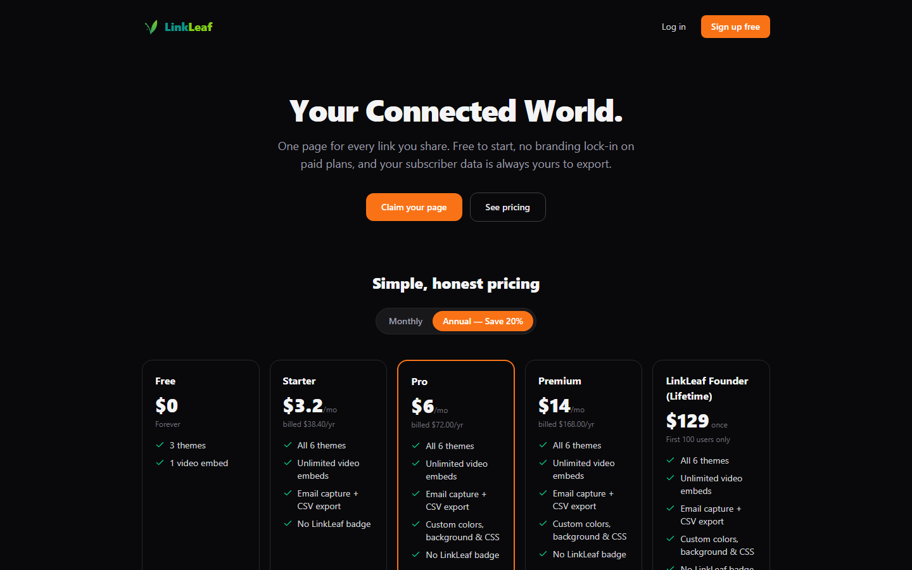
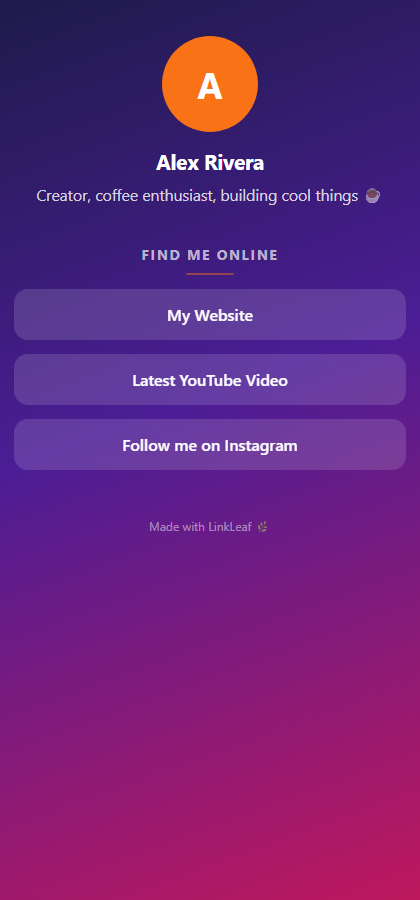
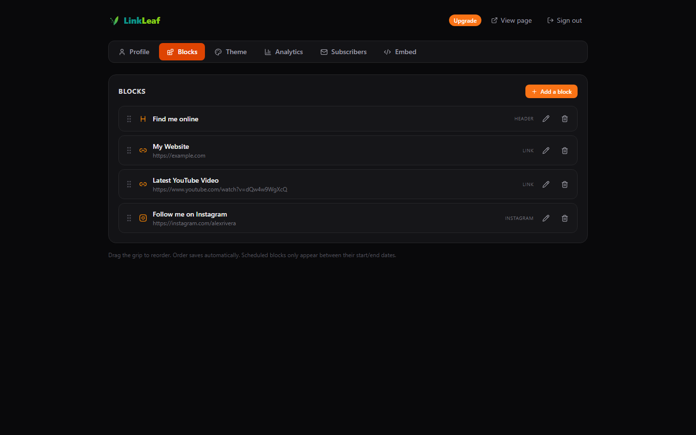
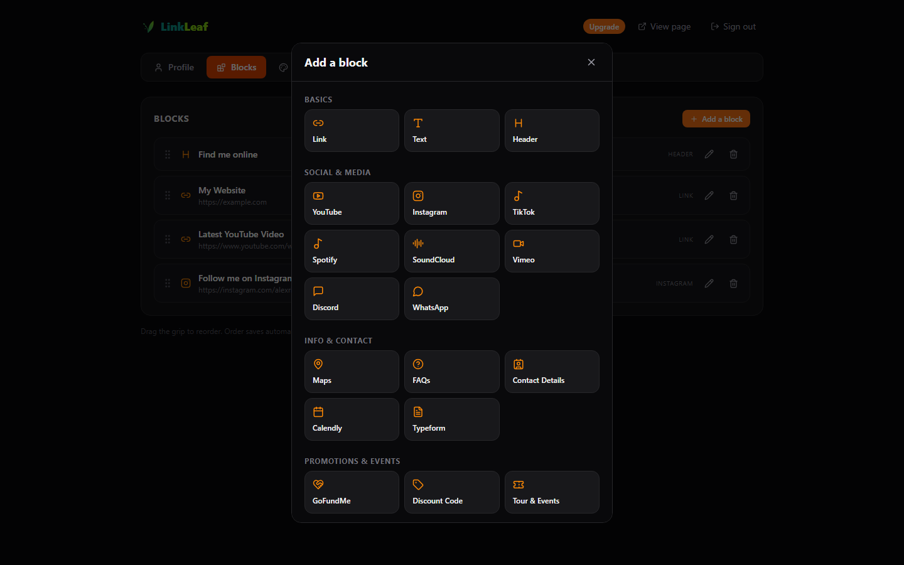
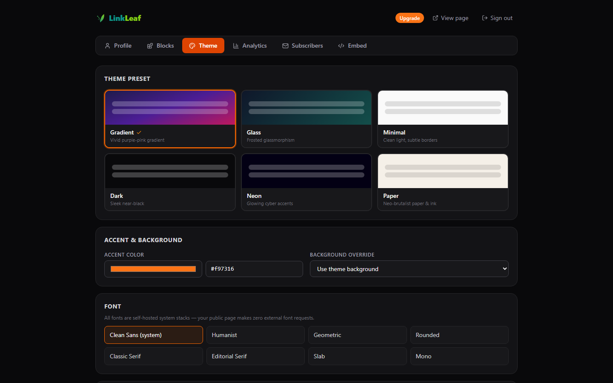
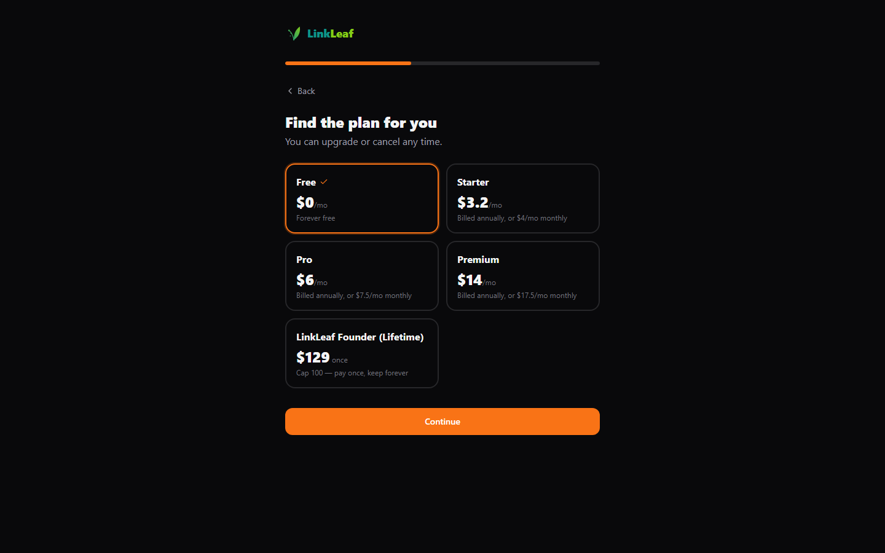
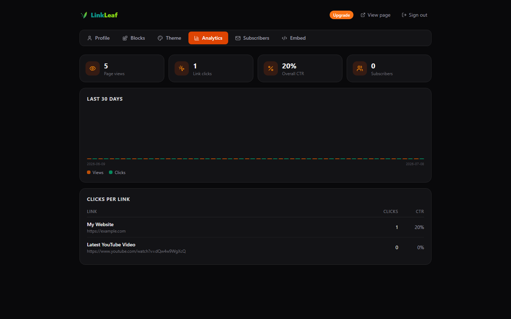

<div align="center">

# 🌿 LinkLeaf

### Your one page for every link you share.

**A beautiful, self-hosted link-in-bio builder. Pay once, own it forever — or use the hosted version. No subscription, no branding lock-in, your data stays yours.**

[](LICENSE)
[](#-run-it-yourself-free)
[](https://linkleaf.im)


[**🚀 Try it hosted →**](https://linkleaf.im) &nbsp;·&nbsp; [**💛 Get the 1-click installer →**](https://whop.com/onetime-suite) &nbsp;·&nbsp; [**⭐ Star this repo**](https://github.com/bensblueprints/Link-Leaf)



</div>

---

## ✨ See it

<table>
  <tr>
    <td width="50%"><br><em align="center">Your public page — fast, mobile-first, zero trackers</em></td>
    <td width="50%"><br><em>Drag-to-reorder block editor</em></td>
  </tr>
  <tr>
    <td width="50%"><br><em>A full catalog of blocks to add</em></td>
    <td width="50%"><br><em>6 polished themes + full custom styling</em></td>
  </tr>
  <tr>
    <td width="50%"><br><em>Claim your handle in a 60-second wizard</em></td>
    <td width="50%"><br><em>Views, clicks & CTR — your data, in your database</em></td>
  </tr>
</table>

---

## 💛 Support the project

LinkLeaf is free and open-source (MIT). If it saves you a Linktree subscription, here's how to show some love:

- ⭐ **Star this repo** — it genuinely helps.
- 🚀 **[Use the hosted version at linkleaf.im](https://linkleaf.im)** — zero setup, paid plans support ongoing development.
- 💛 **[Grab the 1-click installer on Whop](https://whop.com/onetime-suite)** — one-time purchase, a packaged Windows app + guided VPS deploy + lifetime updates. The easiest way to run your own, and it funds the project.

---

## 🎁 Features

- **Profile** — avatar, display name, bio, and a social icon row (Instagram, X, TikTok, YouTube, Facebook, LinkedIn, GitHub, Twitch, Spotify, and more)
- **Rich blocks** — links (with thumbnails + hover animation), headers, text, FAQ accordions, contact cards, discount codes, and embedded **YouTube, Vimeo, Spotify, SoundCloud, Calendly & Typeform**
- **Email capture** — collect subscribers straight into your own database, one-click CSV export
- **Drag to reorder** — grab, drop, done; order saves automatically
- **Scheduling** — give any block a start/end date for launches and limited drops
- **6 polished themes** — gradient, glass, minimal, dark, neon, paper — plus custom accent, background & CSS
- **Analytics** — page views, clicks per link, CTR, 30-day chart — **yours**, never sold
- **Blazing-fast public page** — server-rendered HTML, mobile-first, SEO + Open Graph, **zero external requests** (no font pings, no trackers)

## 🏃 Run it yourself (free)

```bash
npm i
npm run build        # builds the admin UI
npm start            # → http://localhost:5307
```

- **Public page:** `http://localhost:5307/`
- **Admin panel:** `http://localhost:5307/admin` (default password `admin` — change via `ADMIN_PASSWORD`)

### 🖥️ Desktop app

```bash
npm run desktop      # Electron window, auto-logged-in, data stored per-user
npm run dist         # packages a Windows installer (NSIS)
```

### 🐳 Docker (VPS deploy)

```bash
cp .env.example .env # set ADMIN_PASSWORD!
docker compose up -d # persists SQLite + uploads in a named volume
```

Point your domain at the box, put Caddy/nginx/Traefik in front for TLS — `yourname.com` is your link-in-bio.

> **Running a paid, multi-tenant SaaS?** This repo also ships a hosted mode (`APP_MODE=multi`, Postgres + per-user accounts + Whop billing) — that's what powers [linkleaf.im](https://linkleaf.im). See `docker-compose.hosted.yml`.

## ⚖️ LinkLeaf vs Linktree

| | **LinkLeaf** | Linktree |
|---|---|---|
| Price | **Free self-host, or $19 once** | $5–$9/mo, forever |
| Your own domain | ✅ Natively | Paid plan only |
| Branding on your page | **None** | On free plan |
| Email capture + CSV | ✅ Built in | Paid plan |
| Link scheduling | ✅ Built in | Paid plan |
| Analytics | ✅ Yours, in your DB | Theirs |
| Custom CSS | ✅ | ❌ |
| Your data if they ban you | **Always yours** | Gone |
| 3-year cost | **$0–$19** | $180–$324 |

## 🛠️ Tech stack

- **Server:** Node 20+, Express — single process serves API + admin + public page
- **Self-host storage:** better-sqlite3 (WAL) — one file, no external services
- **Hosted mode:** Postgres (multi-tenant), bcrypt auth, Whop billing webhook
- **Admin UI:** React 18, Vite, Tailwind CSS, Lucide icons
- **Public page:** server-rendered plain HTML/CSS — no framework payload, instant on mobile
- **Desktop:** thin Electron wrapper over the same server

## ⚙️ Configuration

| Env var | Default | Purpose |
|---|---|---|
| `PORT` | `5307` | Server port |
| `ADMIN_PASSWORD` | `admin` | Admin panel password (self-host mode) |
| `DATA_DIR` | `./data` | SQLite db + uploaded images |
| `APP_MODE` | `single` | `single` (self-host, SQLite) or `multi` (hosted SaaS, Postgres) |

## 🧑‍💻 Development

```bash
npm start            # API + public page on :5307
npm run dev          # Vite dev server for the admin UI (proxies /api)
npm test             # end-to-end smoke test against a throwaway db
```

## 📄 License

MIT © 2026 Ben ([bensblueprints](https://github.com/bensblueprints)) — build on it, ship it, make it yours.

<div align="center">
<br>
<strong>Made with 🌿 LinkLeaf</strong><br>
<a href="https://linkleaf.im">linkleaf.im</a>
</div>
